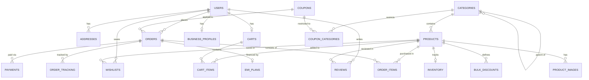

# StationeryHub PostgreSQL Database Design (Updated)

This document outlines the updated database design for **StationeryHub**, incorporating coupon usage limits, multiple product images, institution/organization support, and coupon category restrictions.

---

## 1. Updated Entity Relationship (ER) Diagram

The diagram below maps all entities, including the newly introduced tables and relationships.



---

## 2. Updated Database Schema DDL (SQL Script)

```sql
-- Enable UUID extension if required for primary keys
CREATE EXTENSION IF NOT EXISTS "uuid-ossp";

-- Define Custom Enum Types
CREATE TYPE user_role AS ENUM ('customer', 'admin');
CREATE TYPE order_status AS ENUM ('pending', 'confirmed', 'shipped', 'delivered', 'cancelled');
CREATE TYPE payment_method AS ENUM ('COD', 'advance_full', 'advance_partial', 'EMI');
CREATE TYPE payment_status AS ENUM ('pending', 'completed', 'failed', 'refunded');
CREATE TYPE coupon_discount_type AS ENUM ('percent', 'flat');
CREATE TYPE emi_status AS ENUM ('active', 'completed', 'defaulted');

-- -----------------------------------------------------
-- Table: Users
-- -----------------------------------------------------
CREATE TABLE users (
    id UUID PRIMARY KEY DEFAULT uuid_generate_v4(),
    email VARCHAR(255) UNIQUE NOT NULL,
    password_hash VARCHAR(255) NOT NULL,
    first_name VARCHAR(100) NOT NULL,
    last_name VARCHAR(100) NOT NULL,
    phone_number VARCHAR(15),
    role user_role NOT NULL DEFAULT 'customer',
    created_at TIMESTAMP WITH TIME ZONE DEFAULT CURRENT_TIMESTAMP,
    updated_at TIMESTAMP WITH TIME ZONE DEFAULT CURRENT_TIMESTAMP
);

-- -----------------------------------------------------
-- Table: Business Profiles (B2B Institution/Organization Support)
-- -----------------------------------------------------
CREATE TABLE business_profiles (
    user_id UUID PRIMARY KEY REFERENCES users(id) ON DELETE CASCADE,
    company_name VARCHAR(200) NOT NULL,
    gst_number VARCHAR(20) UNIQUE NOT NULL,
    contact_person VARCHAR(100) NOT NULL,
    created_at TIMESTAMP WITH TIME ZONE DEFAULT CURRENT_TIMESTAMP,
    updated_at TIMESTAMP WITH TIME ZONE DEFAULT CURRENT_TIMESTAMP
);

-- -----------------------------------------------------
-- Table: Addresses
-- -----------------------------------------------------
CREATE TABLE addresses (
    id UUID PRIMARY KEY DEFAULT uuid_generate_v4(),
    user_id UUID NOT NULL REFERENCES users(id) ON DELETE CASCADE,
    address_line_1 VARCHAR(255) NOT NULL,
    address_line_2 VARCHAR(255),
    city VARCHAR(100) NOT NULL,
    state VARCHAR(100) NOT NULL,
    postal_code VARCHAR(20) NOT NULL,
    country VARCHAR(100) NOT NULL DEFAULT 'India',
    is_default BOOLEAN NOT NULL DEFAULT FALSE,
    created_at TIMESTAMP WITH TIME ZONE DEFAULT CURRENT_TIMESTAMP,
    updated_at TIMESTAMP WITH TIME ZONE DEFAULT CURRENT_TIMESTAMP
);

CREATE INDEX idx_addresses_user_id ON addresses(user_id);

-- -----------------------------------------------------
-- Table: Categories
-- -----------------------------------------------------
CREATE TABLE categories (
    id SERIAL PRIMARY KEY,
    name VARCHAR(100) UNIQUE NOT NULL,
    description TEXT,
    parent_category_id INT REFERENCES categories(id) ON DELETE SET NULL,
    created_at TIMESTAMP WITH TIME ZONE DEFAULT CURRENT_TIMESTAMP
);

-- -----------------------------------------------------
-- Table: Products
-- -----------------------------------------------------
CREATE TABLE products (
    id UUID PRIMARY KEY DEFAULT uuid_generate_v4(),
    name VARCHAR(255) NOT NULL,
    description TEXT,
    price NUMERIC(10, 2) NOT NULL CHECK (price >= 0.00),
    sku VARCHAR(100) UNIQUE NOT NULL,
    category_id INT NOT NULL REFERENCES categories(id) ON DELETE RESTRICT,
    created_at TIMESTAMP WITH TIME ZONE DEFAULT CURRENT_TIMESTAMP,
    updated_at TIMESTAMP WITH TIME ZONE DEFAULT CURRENT_TIMESTAMP
);

CREATE INDEX idx_products_category_id ON products(category_id);

-- -----------------------------------------------------
-- Table: Product Images (Allows multiple images per product)
-- -----------------------------------------------------
CREATE TABLE product_images (
    id SERIAL PRIMARY KEY,
    product_id UUID NOT NULL REFERENCES products(id) ON DELETE CASCADE,
    image_url TEXT NOT NULL,
    is_primary BOOLEAN NOT NULL DEFAULT FALSE, -- Flag for main thumbnail
    created_at TIMESTAMP WITH TIME ZONE DEFAULT CURRENT_TIMESTAMP
);

CREATE INDEX idx_product_images_product_id ON product_images(product_id);

-- -----------------------------------------------------
-- Table: Inventory Management
-- -----------------------------------------------------
CREATE TABLE inventory (
    product_id UUID PRIMARY KEY REFERENCES products(id) ON DELETE CASCADE,
    quantity INT NOT NULL DEFAULT 0 CHECK (quantity >= 0),
    low_stock_threshold INT NOT NULL DEFAULT 5 CHECK (low_stock_threshold >= 0),
    updated_at TIMESTAMP WITH TIME ZONE DEFAULT CURRENT_TIMESTAMP
);

-- -----------------------------------------------------
-- Table: Bulk Discounts (Quantity-based)
-- -----------------------------------------------------
CREATE TABLE bulk_discounts (
    id SERIAL PRIMARY KEY,
    product_id UUID NOT NULL REFERENCES products(id) ON DELETE CASCADE,
    min_quantity INT NOT NULL CHECK (min_quantity > 1),
    discount_percent NUMERIC(5, 2) NOT NULL CHECK (discount_percent > 0.00 AND discount_percent <= 100.00),
    created_at TIMESTAMP WITH TIME ZONE DEFAULT CURRENT_TIMESTAMP,
    UNIQUE (product_id, min_quantity)
);

CREATE INDEX idx_bulk_discounts_product_id ON bulk_discounts(product_id);

-- -----------------------------------------------------
-- Table: Coupons
-- -----------------------------------------------------
CREATE TABLE coupons (
    id SERIAL PRIMARY KEY,
    code VARCHAR(50) UNIQUE NOT NULL,
    discount_type coupon_discount_type NOT NULL,
    discount_value NUMERIC(10, 2) NOT NULL CHECK (discount_value > 0.00),
    min_order_value NUMERIC(10, 2) NOT NULL DEFAULT 0.00 CHECK (min_order_value >= 0.00),
    usage_limit INT NOT NULL DEFAULT 100 CHECK (usage_limit > 0),
    used_count INT NOT NULL DEFAULT 0 CHECK (used_count >= 0),
    start_date TIMESTAMP WITH TIME ZONE NOT NULL,
    expiry_date TIMESTAMP WITH TIME ZONE NOT NULL,
    active BOOLEAN NOT NULL DEFAULT TRUE,
    created_at TIMESTAMP WITH TIME ZONE DEFAULT CURRENT_TIMESTAMP,
    
    CONSTRAINT check_dates CHECK (expiry_date > start_date),
    CONSTRAINT check_usage_limit CHECK (used_count <= usage_limit)
);

CREATE INDEX idx_coupons_validity ON coupons(code, active, start_date, expiry_date);

-- -----------------------------------------------------
-- Table: Coupon Categories (Category-based restrictions)
-- -----------------------------------------------------
CREATE TABLE coupon_categories (
    coupon_id INT NOT NULL REFERENCES coupons(id) ON DELETE CASCADE,
    category_id INT NOT NULL REFERENCES categories(id) ON DELETE CASCADE,
    PRIMARY KEY (coupon_id, category_id)
);

-- -----------------------------------------------------
-- Table: Carts & Cart Items
-- -----------------------------------------------------
CREATE TABLE carts (
    id UUID PRIMARY KEY DEFAULT uuid_generate_v4(),
    user_id UUID UNIQUE NOT NULL REFERENCES users(id) ON DELETE CASCADE,
    created_at TIMESTAMP WITH TIME ZONE DEFAULT CURRENT_TIMESTAMP,
    updated_at TIMESTAMP WITH TIME ZONE DEFAULT CURRENT_TIMESTAMP
);

CREATE TABLE cart_items (
    cart_id UUID NOT NULL REFERENCES carts(id) ON DELETE CASCADE,
    product_id UUID NOT NULL REFERENCES products(id) ON DELETE CASCADE,
    quantity INT NOT NULL CHECK (quantity > 0),
    PRIMARY KEY (cart_id, product_id)
);

-- -----------------------------------------------------
-- Table: Wishlist
-- -----------------------------------------------------
CREATE TABLE wishlists (
    user_id UUID NOT NULL REFERENCES users(id) ON DELETE CASCADE,
    product_id UUID NOT NULL REFERENCES products(id) ON DELETE CASCADE,
    created_at TIMESTAMP WITH TIME ZONE DEFAULT CURRENT_TIMESTAMP,
    PRIMARY KEY (user_id, product_id)
);

-- -----------------------------------------------------
-- Table: Orders (Tracks transactional B2B details explicitly)
-- -----------------------------------------------------
CREATE TABLE orders (
    id UUID PRIMARY KEY DEFAULT uuid_generate_v4(),
    user_id UUID NOT NULL REFERENCES users(id) ON DELETE RESTRICT,
    coupon_id INT REFERENCES coupons(id) ON DELETE SET NULL,
    shipping_address_id UUID NOT NULL REFERENCES addresses(id) ON DELETE RESTRICT,
    
    -- Snapshots of organization billing info for B2B bulk orders at checkout
    gst_number VARCHAR(20),
    contact_person VARCHAR(100),
    
    total_raw_amount NUMERIC(10, 2) NOT NULL CHECK (total_raw_amount >= 0.00),
    discount_amount NUMERIC(10, 2) NOT NULL DEFAULT 0.00 CHECK (discount_amount >= 0.00),
    shipping_fee NUMERIC(10, 2) NOT NULL DEFAULT 0.00 CHECK (shipping_fee >= 0.00),
    final_amount NUMERIC(10, 2) NOT NULL CHECK (final_amount >= 0.00),
    
    order_status order_status NOT NULL DEFAULT 'pending',
    created_at TIMESTAMP WITH TIME ZONE DEFAULT CURRENT_TIMESTAMP,
    updated_at TIMESTAMP WITH TIME ZONE DEFAULT CURRENT_TIMESTAMP
);

CREATE INDEX idx_orders_user_id ON orders(user_id);
CREATE INDEX idx_orders_created_at ON orders(created_at);

-- -----------------------------------------------------
-- Table: Order Items
-- -----------------------------------------------------
CREATE TABLE order_items (
    id UUID PRIMARY KEY DEFAULT uuid_generate_v4(),
    order_id UUID NOT NULL REFERENCES orders(id) ON DELETE CASCADE,
    product_id UUID NOT NULL REFERENCES products(id) ON DELETE RESTRICT,
    quantity INT NOT NULL CHECK (quantity > 0),
    unit_price NUMERIC(10, 2) NOT NULL CHECK (unit_price >= 0.00),
    bulk_discount_applied NUMERIC(10, 2) NOT NULL DEFAULT 0.00 CHECK (bulk_discount_applied >= 0.00),
    final_item_price NUMERIC(10, 2) NOT NULL CHECK (final_item_price >= 0.00)
);

CREATE INDEX idx_order_items_order_id ON order_items(order_id);

-- -----------------------------------------------------
-- Table: Payments
-- -----------------------------------------------------
CREATE TABLE payments (
    id UUID PRIMARY KEY DEFAULT uuid_generate_v4(),
    order_id UUID NOT NULL REFERENCES orders(id) ON DELETE CASCADE,
    payment_method payment_method NOT NULL,
    payment_status payment_status NOT NULL DEFAULT 'pending',
    amount_paid NUMERIC(10, 2) NOT NULL CHECK (amount_paid >= 0.00),
    transaction_reference VARCHAR(255),
    created_at TIMESTAMP WITH TIME ZONE DEFAULT CURRENT_TIMESTAMP
);

-- -----------------------------------------------------
-- Table: EMI Plans (For orders >= ₹2000)
-- -----------------------------------------------------
CREATE TABLE emi_plans (
    id UUID PRIMARY KEY DEFAULT uuid_generate_v4(),
    order_id UUID UNIQUE NOT NULL REFERENCES orders(id) ON DELETE CASCADE,
    tenure_months INT NOT NULL CHECK (tenure_months IN (3, 6, 9, 12, 18, 24)),
    interest_rate NUMERIC(5, 2) NOT NULL DEFAULT 0.00 CHECK (interest_rate >= 0.00),
    monthly_installment NUMERIC(10, 2) NOT NULL CHECK (monthly_installment > 0.00),
    status emi_status NOT NULL DEFAULT 'active',
    created_at TIMESTAMP WITH TIME ZONE DEFAULT CURRENT_TIMESTAMP
);

-- -----------------------------------------------------
-- Table: Reviews & Ratings
-- -----------------------------------------------------
CREATE TABLE reviews (
    id UUID PRIMARY KEY DEFAULT uuid_generate_v4(),
    user_id UUID NOT NULL REFERENCES users(id) ON DELETE CASCADE,
    product_id UUID NOT NULL REFERENCES products(id) ON DELETE CASCADE,
    rating INT NOT NULL CHECK (rating >= 1 AND rating <= 5),
    review_text TEXT,
    created_at TIMESTAMP WITH TIME ZONE DEFAULT CURRENT_TIMESTAMP,
    updated_at TIMESTAMP WITH TIME ZONE DEFAULT CURRENT_TIMESTAMP,
    UNIQUE (user_id, product_id)
);

-- -----------------------------------------------------
-- Table: Order Tracking
-- -----------------------------------------------------
CREATE TABLE order_tracking (
    id UUID PRIMARY KEY DEFAULT uuid_generate_v4(),
    order_id UUID NOT NULL REFERENCES orders(id) ON DELETE CASCADE,
    status_update VARCHAR(100) NOT NULL,
    description TEXT,
    location VARCHAR(150),
    updated_at TIMESTAMP WITH TIME ZONE DEFAULT CURRENT_TIMESTAMP
);
```

---

## 3. Implementation of Updates & Additional Rules

### A. Coupon Usage Limit & Count Check
- Added `usage_limit` and `used_count` columns to `coupons`.
- Added the check constraint `CONSTRAINT check_usage_limit CHECK (used_count <= usage_limit)` to guarantee at the database layer that no transaction violates the limits.

### B. Product Images Table
- Defined a `product_images` table supporting 1-to-many images per product.
- Added a `is_primary` boolean column to easily identify the main display thumbnail for product cards.

### C. Institution/Organization B2B Support
- Defined a `business_profiles` table linked 1-to-1 to users, allowing businesses to create corporate profiles (storing persistent settings like company name, GSTIN, and contact details).
- Added snapshot columns `gst_number` and `contact_person` directly to the `orders` table. When a B2B user places an order, their business details are copied to the order record. This keeps invoices legally binding even if the profile changes in the future.

### D. Category-Restricted Coupons
- Added the `coupon_categories` join table mapping coupon rules to specific categories.
- During coupon application, check queries can verify if items in the order match restricted categories before applying the discount.
