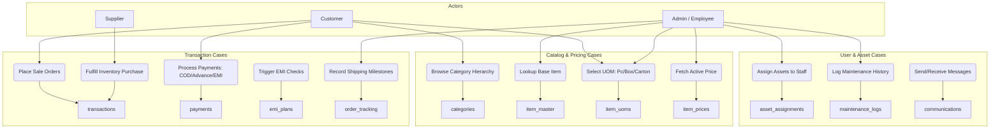

# StationeryHub Database System Specification & Diagrams

This document contains the complete database specification for **StationeryHub**, including the Use Case Diagram, Physical Database Diagram, and a complete Data Dictionary detailing all tables, columns, constraints, and relationships.

---

## 1. Use Case Diagram

The diagram below maps how different actors (Customers, Suppliers, Admins/Employees) interact with the database tables.



---

## 2. Physical Database Diagram

This physical-level diagram shows the tables, column names, exact PostgreSQL data types, primary keys (PK), and foreign keys (FK).

```mermaid
erDiagram
    users {
        uuid id PK
        varchar email UK
        varchar password_hash
        varchar first_name
        varchar last_name
        varchar phone_number
        user_role role
        timestamp created_at
    }

    suppliers {
        uuid id PK
        varchar company_name
        varchar gst_number UK
        varchar contact_person
        varchar phone_number
        varchar email UK
        timestamp created_at
    }

    categories {
        int id PK
        varchar name UK
        text description
        int parent_category_id FK
        timestamp created_at
    }

    item_master {
        uuid id PK
        varchar name
        text description
        varchar sku_base UK
        int category_id FK
        timestamp created_at
    }

    units_of_measure {
        int id PK
        varchar name UK
        varchar abbreviation UK
    }

    item_uoms {
        uuid id PK
        uuid item_id FK
        int uom_id FK
        int quantity_multiplier
        varchar sku_uom UK
    }

    item_prices {
        uuid id PK
        uuid item_uom_id FK
        numeric unit_price
        timestamp effective_from
        timestamp effective_to
        boolean is_active
    }

    inventory {
        uuid item_uom_id PK_FK
        int quantity
        int low_stock_threshold
        timestamp updated_at
    }

    assets {
        uuid id PK
        varchar name
        varchar serial_number UK
        varchar asset_tag UK
        asset_status status
        date purchase_date
        timestamp created_at
    }

    asset_assignments {
        uuid id PK
        uuid asset_id FK
        uuid user_id FK
        timestamp assigned_at
        timestamp returned_at
        text remarks
    }

    maintenance_logs {
        uuid id PK
        uuid asset_id FK
        timestamp maintenance_date
        text description
        numeric cost
        varchar performed_by
        date next_due_date
    }

    communications {
        uuid id PK
        uuid user_id FK
        uuid asset_id FK
        varchar channel
        varchar subject
        text message
        timestamp sent_at
    }

    transactions {
        uuid id PK
        transaction_type type
        uuid customer_user_id FK
        uuid supplier_id FK
        numeric total_raw_amount
        numeric discount_amount
        numeric shipping_fee
        numeric final_amount
        order_status status
        varchar gst_number
        timestamp created_at
    }

    transaction_items {
        uuid id PK
        uuid transaction_id FK
        uuid item_uom_id FK
        int quantity
        numeric unit_price
        numeric final_item_price
    }

    payments {
        uuid id PK
        uuid transaction_id FK
        payment_method payment_method
        payment_status payment_status
        numeric amount_paid
        varchar transaction_reference
        timestamp created_at
    }

    emi_plans {
        uuid id PK
        uuid transaction_id UK_FK
        int tenure_months
        numeric interest_rate
        numeric monthly_installment
        emi_status status
        timestamp created_at
    }

    order_tracking {
        uuid id PK
        uuid transaction_id FK
        varchar status_update
        text description
        varchar location
        timestamp updated_at
    }

    %% Relationships
    categories ||--o{ categories : "parent_category_id"
    categories ||--o{ item_master : "category_id"
    item_master ||--o{ item_uoms : "item_id"
    units_of_measure ||--o{ item_uoms : "uom_id"
    item_uoms ||--o{ item_prices : "item_uom_id"
    item_uoms ||--o| inventory : "item_uom_id"
    item_uoms ||--o{ transaction_items : "item_uom_id"
    
    users ||--o{ asset_assignments : "user_id"
    users ||--o{ communications : "user_id"
    users ||--o{ transactions : "customer_user_id"
    
    suppliers ||--o{ transactions : "supplier_id"
    
    assets ||--o{ asset_assignments : "asset_id"
    assets ||--o{ maintenance_logs : "asset_id"
    assets ||--o{ communications : "asset_id"
    
    transactions ||--o{ transaction_items : "transaction_id"
    transactions ||--o{ payments : "transaction_id"
    transactions ||--o| emi_plans : "transaction_id"
    transactions ||--o{ order_tracking : "transaction_id"
```

---

## 3. Data Structures & Table Specification

### Module A: Core User & Organization Structure
1. **`users`**
   - Stores account credentials, contact data, and roles (`customer`, `admin`, `employee`).
   - Links: Parent to `asset_assignments`, `communications`, and customer-side `transactions`.
2. **`suppliers`**
   - Tracks corporate suppliers supplying items to StationeryHub.
   - Links: Parent to `transactions` (`supplier_purchase` type).
3. **`categories`**
   - Catalog index support (e.g., "Paper", "Writing Instruments"). Links back to itself to define hierarchies (e.g., "Notebooks" under "Paper").
   - Links: Parent to `item_master`.

### Module B: Item Master & Pricing Structure
1. **`item_master`**
   - The central list of products. Contains static specifications (Name, Description, Base SKU).
   - Links: Parent to `item_uoms`.
2. **`units_of_measure`**
   - Lookup containing UOM metadata (Piece, Box, Carton).
   - Links: Parent to `item_uoms`.
3. **`item_uoms`**
   - Maps which products support which packaging configurations. Calculates parent conversions (e.g., 1 Box = 12 Pieces).
   - Links: Parent to `item_prices`, `inventory`, and `transaction_items`.
4. **`item_prices`**
   - Dedicated price ledger to track values independently of item metadata.
   - Links: Child of `item_uoms`.

### Module C: Assets, Maintenance & Tracking
1. **`assets`**
   - Tracks corporate devices, logistics equipment, and facilities.
   - Links: Parent to `asset_assignments`, `maintenance_logs`, and `communications`.
2. **`asset_assignments`**
   - Log tracking who is/was in possession of specific assets.
3. **`maintenance_logs`**
   - Tracks repair entries, durations, costs, and providers for company hardware.
4. **`communications`**
   - Historical records of emails/notifications sent to staff/users, optionally tagged to assets.

### Module D: Transactions Ledger
1. **`transactions`**
   - Unified ledger recording B2C customer orders and B2B vendor supply transactions.
2. **`transaction_items`**
   - Details item quantities, custom pricing rates, and subtotals per line.
3. **`payments`**
   - Logs monetary transfers (COD collections, online deposits, down payments).
4. **`emi_plans`**
   - Payment logs recording credit arrangements for sales above ₹2000.
5. **`order_tracking`**
   - Records logistic checkpoints ("Shipped", "Out for Delivery", "Delivered") with timestamps and GPS/city tags.
